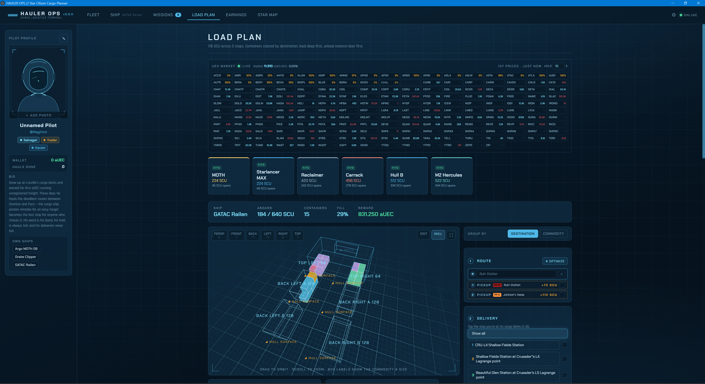
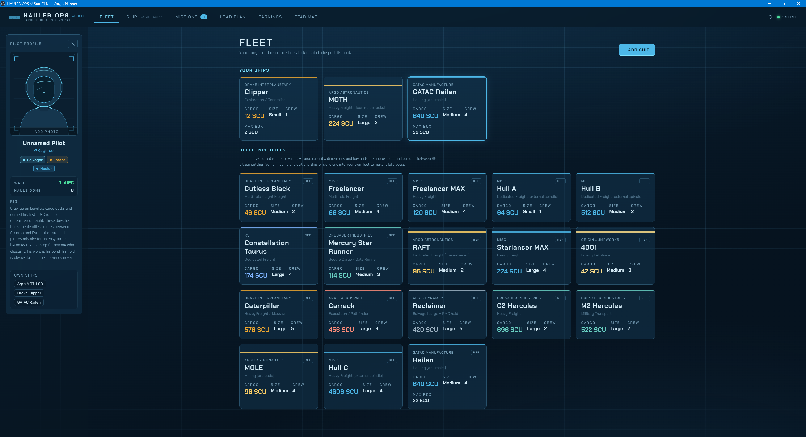
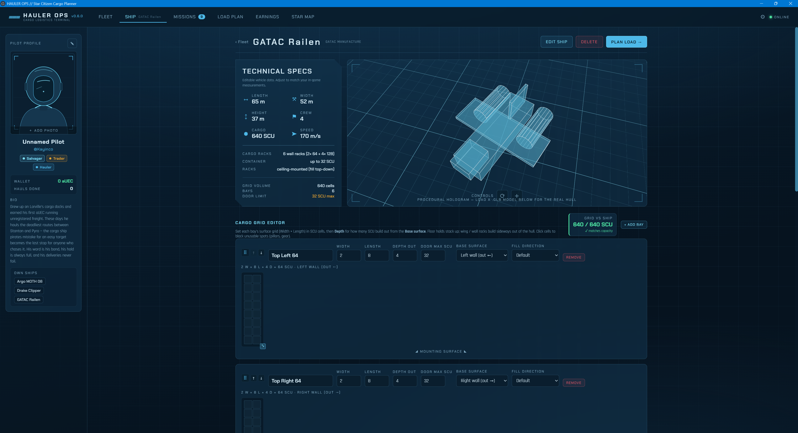
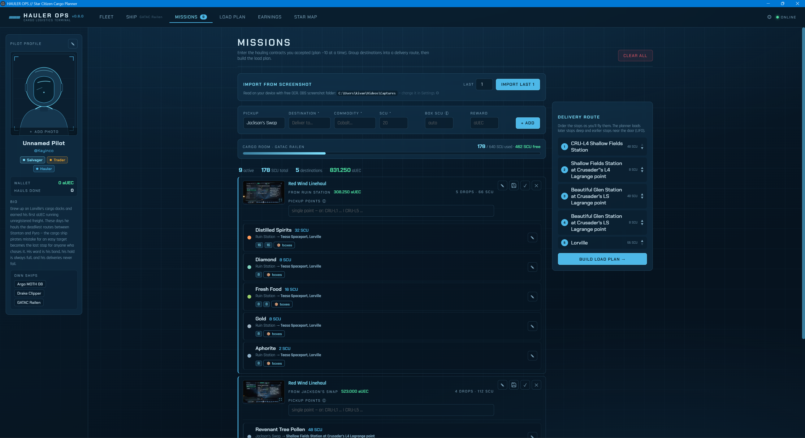
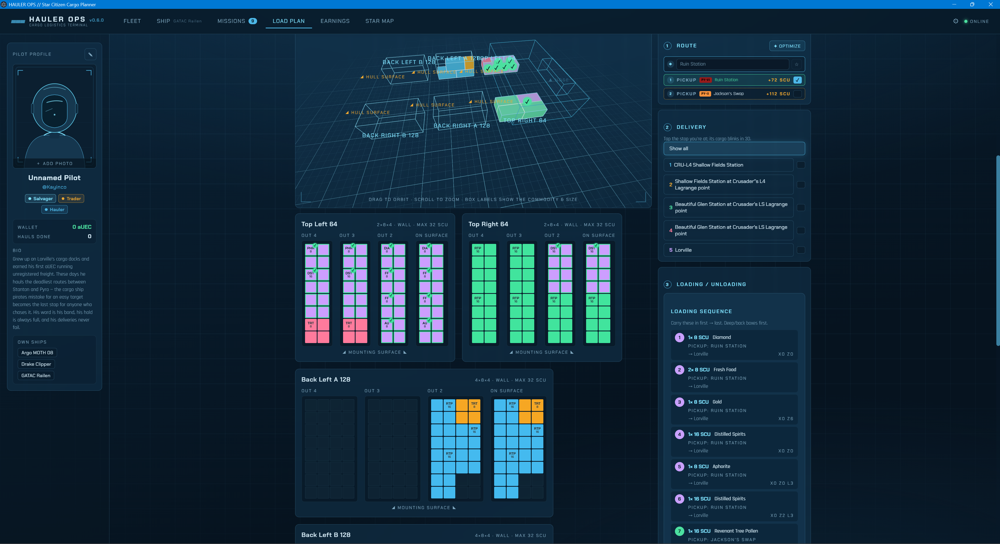
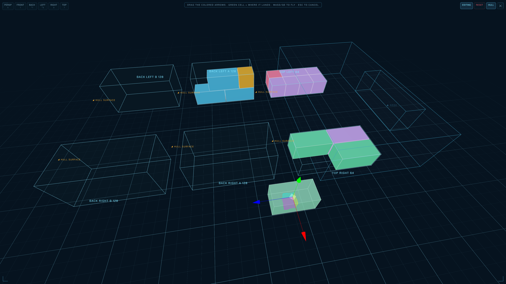
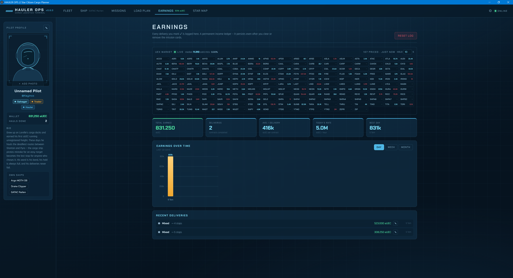
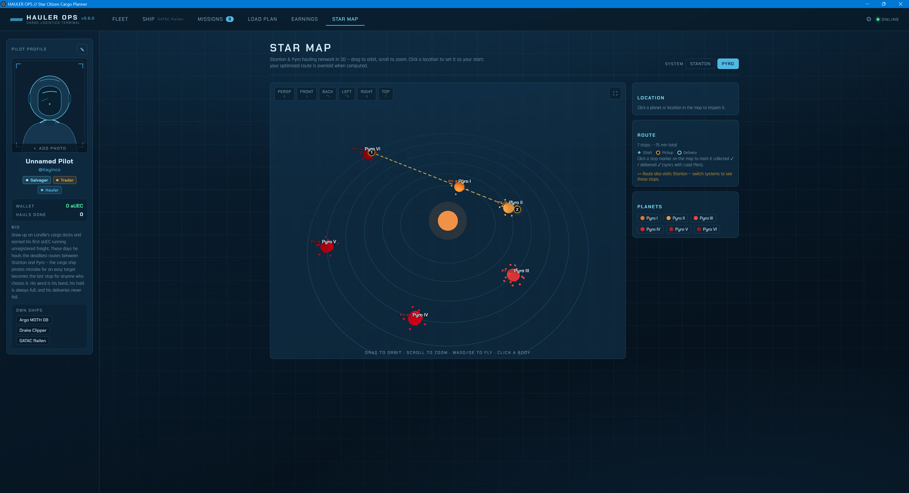
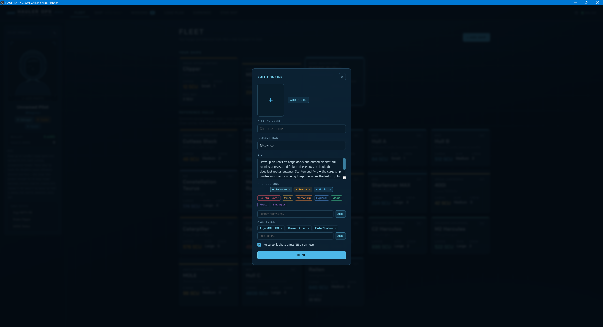
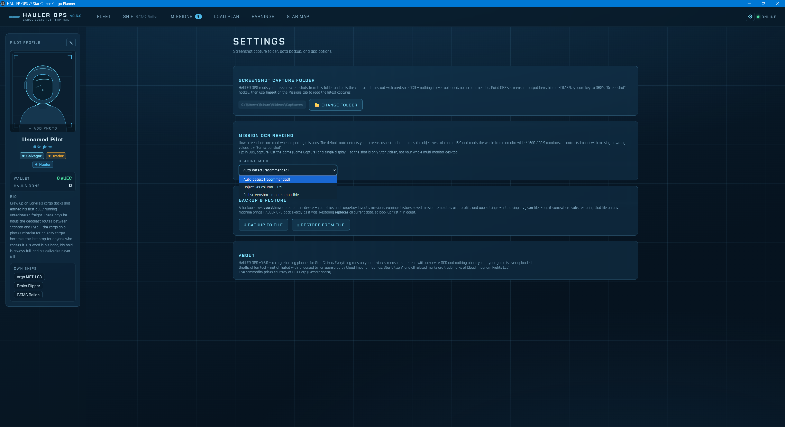

# HAULER OPS

**A cargo-hauling planner for Star Citizen.** Snap a screenshot of your contracts and HAULER OPS
reads them with on-device OCR, plans the most efficient multi-stop route, and shows exactly how to
pack your ship's hold in 2D and 3D — which crate goes where, and in what load/unload order.

> Unofficial fan tool. Runs entirely on your PC — no account, no cloud, nothing about you or your
> game is ever uploaded.

<p align="center">
  
</p>

---

## Features

- **Screenshot import (OCR)** — point OBS at a folder, screenshot a contract in-game, and the app
  extracts commodity, SCU, pickup and drop-off automatically. Reads on your device, offline.
- **Multi-stop route optimizer** — orders pickups and deliveries for the shortest run.
- **2D + 3D load plan** — every container placed in the hold with a LIFO-aware load/unload order,
  so you load deep-first and unload nearest-the-door first without reshuffling at each stop.
- **Fleet library** — reference hulls plus your own ships; fully editable cargo grids.
- **Live market board** — current commodity prices courtesy of [UEX Corp](https://uexcorp.space).
- **Earnings history** — logs every delivery and your aUEC/hour.
- **Mission templates** — OCR can occasionally misread an SCU value, and you often only learn a
  contract's true box sizes once you reach the pickup. Correct a contract once, hit 💾 to save it, and
  the next time you accept that same contract HAULER OPS recognizes it and auto-fills your corrected
  box and pickup layout — so you only ever enter each contract right once.
- **Pilot profile**, backup/restore, 3D star map, and more.

## Screenshots

|  |  |
|:---:|:---:|
| <br>**Fleet** — your hangar plus reference hulls, each with a fully editable cargo grid. | <br>**Ship detail** — holographic viewer, editable tech specs, and a per-bay grid editor. |
| <br>**Missions** — screenshot a contract in-game; OCR fills in commodity, SCU, pickup and drop-off. | <br>**Load plan** — every crate placed in each bay with a LIFO-aware load/unload sequence. |
| <br>**3D hold** — orbit the hold and see exactly where each container sits. | <br>**Earnings** — a permanent income ledger with your aUEC/hour. |
| <br>**Star Map** — Stanton & Pyro in 3D with your optimized route overlaid. | <br>**Pilot profile** — name, bio, professions and your owned ships. |

## Install (Windows)

1. Download the latest `HAULER OPS.exe` from the [Releases](../../releases) page.
2. Run it — it's a portable app, no installer.
3. **SmartScreen warning:** since the app isn't code-signed, Windows may show "Windows protected
   your PC". Click **More info → Run anyway**. (The full source is in this repo if you'd rather
   inspect or build it yourself.)

## Setup: capturing contracts

HAULER OPS reads mission screenshots from one folder you choose. **Any screenshot tool works** — you
don't need OBS. All that matters is that a **full-screen shot of the game** lands in that folder.

1. In HAULER OPS, open **⚙ Settings → Screenshot Capture Folder** and choose (or confirm) a folder.
2. Point your screenshot tool at that folder:
   - **No extra software (recommended):** Windows' built-in Game Bar — press **Win + Alt + PrtScn**
     in-game to save a full-screen shot to `Videos\Captures`, then set that as your HAULER OPS folder.
   - **OBS (optional):** if you already use OBS, set its **Screenshot** output to the folder and bind
     a hotkey — handy if it's already part of your capture setup.
3. In-game, open a contract's details and take the screenshot.
4. In HAULER OPS → **Missions → Import** to read the latest captures.

Whatever tool you use, the shot should show the **whole game screen** — not just a window or your
multi-monitor desktop — so the contract text reads cleanly.

**Different monitor / resolution?** OCR auto-detects your aspect ratio: on 16:9 it crops the
objectives column for best accuracy; on ultrawide / 16:10 / 32:9 it reads the whole frame. You can
force a mode under **Settings → Mission OCR Reading**.

<p align="center">
  
</p>

## Privacy

Your data stays yours:

- Screenshots and OCR are processed **100% locally** (bundled WASM engine).
- The **only** outbound calls fetch **public commodity prices from UEX Corp** — no personal or
  game data is ever sent.
- No telemetry, analytics, or accounts.

**Full transparency:**
- The Electron shell runs with `webSecurity` disabled so the offline OCR engine can load its assets
  from local files. The app only loads bundled local files, never remote content.
- If the bundled OCR engine fails to load, the app falls back to downloading the engine from a
  public CDN. This fetches the OCR engine only — it never uploads your screenshots or data.

## Reference ship data

Built-in ship values (cargo, dimensions, bay grids) are **community-sourced references** and may
drift between Star Citizen patches. Verify in-game and edit any ship, or clone it into your own
fleet. Corrections via pull request are welcome.

## Build from source

Requires [Node.js](https://nodejs.org).

```bash
npm install
npm run package:app     # builds the web app + assembles the portable app into release/HAULER-OPS/
```

- `npm run electron:dev` — run in development with live reload.
- `npm run dist` — single-file build via electron-builder. On Windows you may need to add the
  project folder to your antivirus / Controlled Folder Access exclusions, or it can fail with an
  `EPERM` rename error.

### Project structure

```
src/
  data/        ships, containers (SCU footprints), commodities
  lib/         optimizer + route optimizer (packing, LIFO load/unload, ship recommender)
  store/       zustand store (localStorage persisted)
  components/
    layout/    top nav + pilot profile sidebar
    fleet/     ship cards
    ship/      detail page, tech specs, cargo grid editor
    hologram/  Three.js holographic viewer (procedural + .glb loader)
    mission/   screenshot import (OCR) + mission entry + delivery route
    plan/      load plan, 2D bay maps, 3D hold, load/unload sequences
    settings/  capture folder, OCR mode, backup/restore, about
electron/      main + preload (desktop shell)
```

### Custom ship models

The hologram uses a procedural placeholder by default. To use a real hull, drop a `.glb` in
`public/models/`, then open the ship → **Edit Ship** → set the model file. The holographic material
is applied automatically.

## Credits

- Commodity market data from [UEX Corp](https://uexcorp.space).
- Built with React, Three.js, Zustand, and [tesseract.js](https://github.com/naptha/tesseract.js).

## Disclaimer

This is an unofficial fan-made tool. It is **not affiliated with, endorsed by, or sponsored by
Cloud Imperium Games**. Star Citizen®, Squadron 42®, and all related marks are trademarks of Cloud
Imperium Rights LLC. This tool is free and always will be.

## License

[MIT](LICENSE) © 2026 Kayinco
